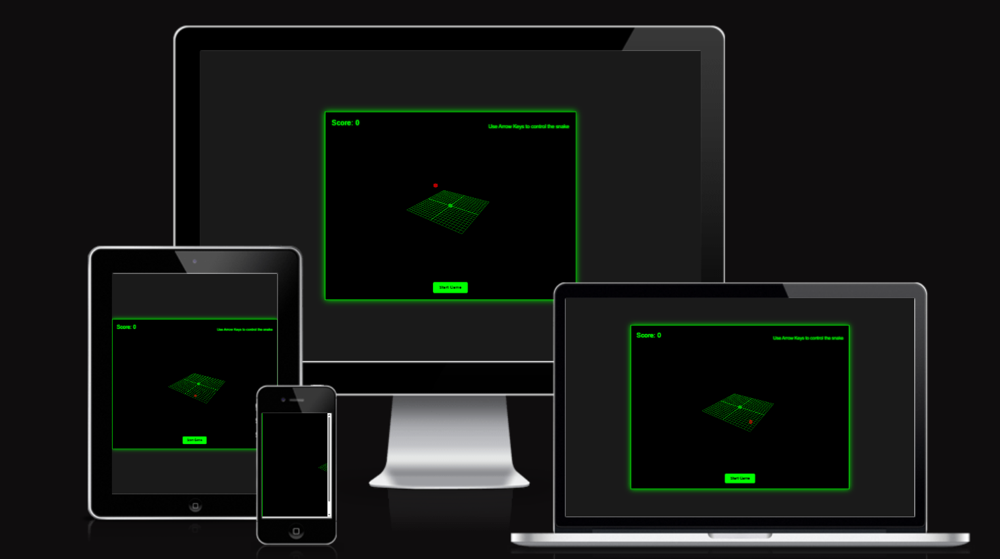

# 3D Snake Game

## 🐍 Game Overview
A modern twist on the classic Snake game, now in 3D! Built with Three.js, this game features smooth controls, dynamic lighting, and increasing difficulty as you score points.
The site can be accessed through the [link](https://ebuka-martins.github.io/3d-snake-game/)

## 🎮Features
3D Graphics: Rendered with Three.js for an immersive experience

Controls: Arrow keys (↑, ↓, ←, →) to navigate

**Game Mechanics:**
 - Grow longer by eating red food cubes
 - Speed increases as your score goes up
 - Game over if you hit walls or yourself

**UI:** Start, Pause, and Restart buttons for easy gameplay management

## 🚀 How to Play
Start the game using the "Start Game" button

Control the snake using arrow keys

Eat the red food to grow and increase your score

Avoid hitting walls or your own tail

